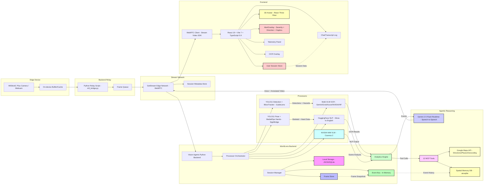

# WorldLens — System Architecture & Data Flow

## Overview

WorldLens is a real-time assistive vision platform with three main layers:

1. **Backend** — Vision Agents SDK orchestrating YOLO11 detection, MediaPipe hands, multi-VLM OCR, Gemini 2.5 Flash Realtime reasoning, and 12 MCP tools
2. **Frontend** — React 19 SPA with WebRTC video, hazard alerts, 3D avatar, and telemetry
3. **Edge Device** (Optional) — Camera capture (webcam, phone, or M5Stack K210 with on-device YOLO v2 tiny) - Requires M5Stick

All layers communicate via GetStream's Edge Network (WebRTC) for real-time video/audio, and REST polling for alerts, telemetry, and OCR.

---

## End-to-End Data Flow

```
1. Camera captures frame
       ↓
2. GetStream Edge Network (WebRTC transport, sub-200ms)
       ↓
3. Vision Agents Backend receives frame
       ↓
4. Frame dispatched to active processors:
   ├── GuideLens: YOLO11 Detection → BboxTracker → HazardDetectedEvent / SceneSummaryEvent
   ├── SignBridge: YOLO11 Pose → MediaPipe Hands → SignDetectedEvent / GestureBufferEvent
   └── OCR: Multi-VLM chain → OCRResultEvent / SceneDescriptionEvent
       ↓
5. Events published to Event Bus (BaseEvent pub/sub)
       ↓
6. Event handlers in main.py:
   ├── Hazards → agent.simple_response() → Gemini speaks warning
   ├── Scene summaries → agent.simple_response() → Gemini describes environment
   ├── OCR text → agent.simple_response() → Gemini reads text aloud
   └── Sign detections → agent.simple_response() → Gemini interprets
       ↓
7. Gemini 2.5 Flash Realtime:
   ├── Sees live video frames (5 FPS)
   ├── Hears user's voice (speech-to-speech)
   ├── Reasons over events + conversation context
   ├── Autonomously calls MCP tools (Maps, Memory, Weather, etc.)
   └── Speaks response back via WebRTC audio
       ↓
8. Frontend receives:
   ├── Annotated video (bounding boxes / skeleton overlays) via WebRTC
   ├── Agent's voice response via WebRTC audio
   ├── Hazard alerts via REST polling (/navigation/hazards/poll)
   ├── Telemetry via REST polling (/telemetry)
   └── OCR results via REST polling (/ocr-results)
```

---

## Detailed Mermaid Diagram



---

## Component Details

### Edge Device Layer

| Component | Technology | Details |
|-----------|-----------|---------|
| **Webcam / Phone Camera** | WebRTC via GetStream | Primary input — any browser camera works |
| **Camera Bridge** | `m5_bridge.py` | Converts RTSP/MJPEG/serial streams into VideoForwarder frames for the SDK |

### Backend Processing Layer

| Component | Technology | Details |
|-----------|-----------|---------|
| **GuideLens Processor** | YOLO11 (`yolo11n.pt`) | 80 COCO classes, BboxTracker for approach speed, direction (L/C/R) and distance (near/med/far) estimation |
| **SignBridge Processor** | YOLO11 Pose (`yolo11n-pose.pt`) + MediaPipe | 17 body + 42 hand keypoints, gesture buffer (30 frames), ASL letter recognition |
| **OCR Processor** | Multi-VLM fallback | Azure GPT-4o → Gemini → Grok → NVIDIA Cosmos → HuggingFace. Lazy init, health checks, auto-failover |
| **Navigation Engine** | `navigation_engine.py` | SmartAnnouncer with priority-based cooldowns, route step tracking, user speech suppression |
| **Spatial Memory** | `spatial_memory.py` (aiosqlite) | Persistent detection log — label, confidence, position, direction, timestamp. 30s dedup cooldown |

### Reasoning Layer

| Component | Technology | Details |
|-----------|-----------|---------|
| **Gemini 2.5 Flash Realtime** | `gemini.Realtime(fps=5)` via Vision Agents SDK | Full speech-to-speech: sees video, hears voice, speaks back. System prompt defines behavior per mode |
| **12 MCP Tools** | `@agent.llm.register_function()` | Maps directions, nearby places, spatial memory, haptic alerts, weather, time, colors, emergency, device status, OCR, scene description |
| **Event Handlers** | `@agent.events.subscribe` | 13 handlers: user/agent speech, participant join/leave, hazard/scene/OCR/sign events |

### Frontend Layer

| Component | Technology | Details |
|-----------|-----------|---------|
| **WebRTC Client** | `@stream-io/video-react-sdk` | Full-duplex video + audio via GetStream Edge CDN |
| **AlertOverlay** | Web Audio API + Vibration API | 3 severity levels, directional glow, audio chimes, haptic feedback |
| **3D Avatar** | `@react-three/fiber` + Three.js | Lip-sync via viseme morph targets, geometric fallback |
| **Telemetry Panel** | React polling component | Inference latency, FPS, object counts, provider status |

---

## Communication Protocols

| Path | Protocol | Latency | Data |
|------|----------|---------|------|
| Camera → Backend | WebRTC (GetStream Edge) | <200ms | Live video frames + audio |
| Backend → Frontend (video) | WebRTC (GetStream Edge) | <200ms | Annotated video + agent voice |
| Backend → Frontend (alerts) | REST polling (2s) | ~2s | Hazard alerts (JSON) |
| Backend → Frontend (telemetry) | REST polling (3s) | ~3s | Metrics (JSON) |
| Backend → Frontend (OCR) | REST polling (5s) | ~5s | Detected text (JSON) |
| Gemini → Backend | gRPC (Google API) | ~200-500ms | LLM responses + tool calls |
| Backend → Google Maps | HTTPS REST | ~300ms | Directions, places, geocoding |
| M5Stack → Host | USB serial (115200 baud) | <50ms | JPEG frames + detection JSON |
